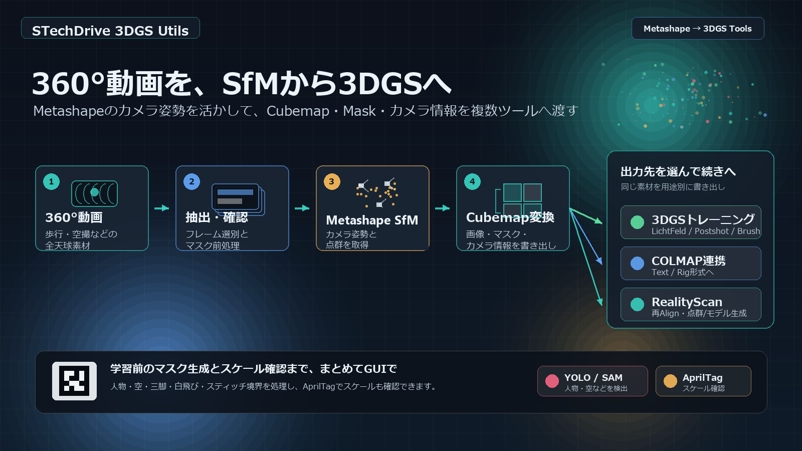

# stechdrive-3dgs-utils

**v1.21.0**

360°動画、通常動画、連番静止画から、3D Gaussian Splatting (3DGS) のトレーニングに使いやすい画像・マスク・カメラデータを作るためのWindows向け統合GUIツールです。

`setup_windows.bat` がPython 3.12とFFmpeg/FFprobeの検出、必要に応じたwinget経由のインストール、仮想環境の作成、依存パッケージ導入まで行います。起動も `run_gui.bat` から行えるため、普段の作業ではPythonコマンドを直接打たずに使えます。

## ダウンロード

通常利用は、最新リリースZIPをダウンロードしてください。

[stechdrive-3dgs-utils-v1.21.0.zip をダウンロード](https://github.com/stechdrive/stechdrive-3dgs-utils/releases/download/v1.21.0/stechdrive-3dgs-utils-v1.21.0.zip)

ZIPを展開したら、`setup_windows.bat`、続いて `run_gui.bat` を実行します。

[EN English](README.md)




## このアプリでできること

### 1. 360°/通常画像を混在させたSfM前処理

Insta360 / Osmo 360などの360°動画、スマホやデジタル一眼の通常動画、既に切り出した連番静止画を同じシーンに登録できます。Step 2で採用/除外を確認し、Step 3で人物、撮影者、三脚、空、スティッチ境界、白飛びなどをマスクしてから、Metashape、COLMAP、SphereSfM、RealityScanなどへ渡せます。

MetashapeでSfMした結果は、NeRF系の `transforms.json` / `pointcloud.ply`、COLMAP形式データセット、またはRealityScan再アライン用のCubemap/XMPへ変換できます。LichtFeld Studio、Postshot、Brushなど、読み込ませる学習アプリに合わせてStep 5で出力形式を選びます。

### 2. アプリ内でSfMする

Metashapeを使わない場合は、Step 4でCOLMAPまたはSphereSfMを実行できます。COLMAPは360°画像をCubemap Rigへ展開し、通常画像は通常カメラとして扱うため、混在ソースを使いたい場合に向いています。SphereSfMは同一解像度のエクイレクタングラー360°画像だけを入力にするルートです。

### 3. RealityScanからLichtFeldへ

RealityScanで再アラインしたCSV/PLYを、LichtFeldでDatasetとして開けるCOLMAP形式へ変換できます。RealityScanでCubemapと通常画像を混在アラインした場合でも、Cubemap由来のPINHOLE画像はリンクで参照し、必要な通常画像だけレンズ補正してPINHOLE化できます。

### 4. 通常の静止画・動画向けのマスク前処理

デジタル一眼・スマホなどで撮影した通常動画、または通常画像の連番画像に対しても、YOLO/SAM2.1による高速な人物・車両などのマスク、SAM3.1による人物・空などの高精度マスク、補助的なMask2Former空マスク、白飛びマスクを作成できます。360°画像と通常画像が混在していても、画像タイプに合わせて処理します。

## 主な特徴

- 360°動画、通常動画、連番静止画を同じシーンの入力ソースとして登録できます。動画はフレーム抽出し、静止画フォルダは `images/` にコピーして、以降の確認・マスク・SfM工程で同じように扱えます。
- 抽出したフレームは、1枚表示またはサムネイル一覧で確認できます。不要なフレームを採用/除外として整理でき、ブレ候補は自動除外と要確認に分かれます。問題ないように見える画像までブレ候補になる場合は、Step 2でブレ判定を標準/低感度から選べます。360°画像はFOV90°の透視投影表示で細部を確認できます。
- 人物、撮影者、三脚、手元、車両、空、白飛び、スティッチ境界など、SfMや3DGSで邪魔になりやすい領域をマスクできます。人物だけを高速に処理したい場合はYOLO/SAM2.1、人物と空を高精度に処理し、後から漏れや誤検出も直したい場合はSAM3.1を使えます。
- マスク結果は保存前にプレビューでき、サムネイル一覧でも確認できます。漏れや誤検出がある画像だけを選んで再生成できるため、全画像を最初からやり直す必要がありません。
- SAM3.1では、既存マスクに対して「三脚を追加する」「看板やロゴの誤検出を外す」といった加算/減算の補正ができます。手作業で塗り直す量を減らせます。
- Mask2Formerは、SAM3.1を使わずに空マスクを試したい場合の補助的な選択肢として利用できます。
- 360°画像だけでなく、通常動画からのフレーム抽出や通常画像の連番画像にも使えます。人物・車両・空・白飛びなどを、SfMに渡す前のマスク前処理としてまとめて作成できます。
- Step 4では、外部SfM結果を使うか、COLMAP/SphereSfMをこのアプリから実行するかを選びます。COLMAPは360°画像のCubemap Rigと通常画像カメラの混在に対応し、SphereSfMは同一解像度のエクイレクタングラー360°画像だけを扱うルートです。
- Step 5では、Metashape / SphereSfM / RealityScan / COLMAPの結果から、NeRF系JSON/PLY、COLMAP形式データセット、LichtFeld向けRealityScan変換、AprilTagスケール補正などを選んで実行できます。
- シーンプレビューで、SfM結果やデータセットの点群、カメラ位置、選択カメラの画像、対応マスクを同じ画面で確認できます。Step 4のカードから開くほか、`run_scene_preview.bat` でビューワーだけ起動できます。
- AprilTagを撮影前に印刷・配置しておけば、Step 5の `スケール調整` で出力済みデータセットからメートル換算のスケールを推定できます。推定値を確認してから、対象データセットのカメラ位置と点群へ同じscaleを反映できます。
- Windows向けセットアップスクリプトで、Python環境、FFmpeg/FFprobe、主要Pythonパッケージの準備をまとめて行えます。通常利用は `run_gui.bat` から起動できます。

## かんたん導入

通常はリリースZIPを展開し、次の2つを順番に実行します。

```bat
setup_windows.bat
run_gui.bat
```

初回の `setup_windows.bat` は少し時間がかかります。Python 3.12、FFmpeg/FFprobe、GPU向けのPythonパッケージなどを確認し、不足しているものをできる範囲で準備します。

Pythonパッケージはこのアプリ専用の仮想環境に入れるため、普段使っているPython環境を汚しにくい構成です。セットアップ完了後は、通常 `run_gui.bat` を実行するだけでGUIを起動できます。

### セットアップが内部で行うこと

`setup_windows.bat` はPython 3.12とFFmpeg/FFprobeを探し、必要な場合はwinget経由で不足しているシステム依存を導入します。その後、リポジトリ内にこのアプリ専用の仮想環境 `.venv/` を作成し、PyTorch CUDA wheel、OpenCV、Pillow、Open3D、ultralytics、PySide6、SAM3.1実行用パッケージなどをインストールして検証します。

Pythonパッケージは `.venv/` に閉じ込めるため、システム全体や他プロジェクトのPython環境には基本的にインストールしません。`.venv/` は内部用の作業場所なので、通常は手動で編集する必要はありません。

### 環境を更新・作り直す場合

通常は不要です。既存環境を互換する最新パッケージへ更新する場合だけ、次を実行します。

```bat
update_venv.bat
```

`requirements/` の検証済み固定セットで作り直す場合は `update_venv.bat --locked`、環境を最初から作り直す場合は `setup_windows.bat --force` を使います。

YOLO/SAM2、Mask2Former、SAM3.1のモデルファイルは初回利用時にダウンロードされる場合があります。ローカルのYOLO/SAM重みは `models/ultralytics/`、Mask2Former重みは `models/mask2former-swin-large-ade-semantic/`、SAM3.1プロンプトマスクは `models/sam3.1/sam3.1_multiplex.pt` を使います。リリースZIPにはモデル重み、生成データ、ユーザー設定、ローカルセットアップログは含めていません。これらの第三者ライブラリおよびモデル重みには別ライセンスが適用されます。詳細は [THIRD_PARTY_LICENSES.md](THIRD_PARTY_LICENSES.md) を参照してください。

### マスク生成モデルの使い分け

- 人物だけを高速にマスクしたい場合は YOLO/SAM2.1 が向いています。
- 人物や空をできるだけ高精度にマスクしたい場合は SAM3.1 を推奨します。プロンプトで対象を指定できるため、生成後に漏れた対象だけを加算したり、誤検出だけを減算できます。
- Mask2Former は、SAM3.1を導入していない環境でも空マスクを手軽に試したい場合の選択肢です。

### SAM3.1プロンプトマスク

`setup_windows.bat` はSAM3.1の実行用パッケージを入れますが、checkpointは同梱しません。checkpointの取得にはユーザー自身のHugging FaceアカウントとSAM Licenseへの同意が必要なためです。

このアプリでは、公式 `facebook/sam3.1` の `sam3.1_multiplex.pt` を使います。SAM3.1はCUDA対応GPU向けモデルです。NVIDIA製GPU環境での実行を推奨します。

SAM3.1の一括処理中にGPUメモリ不足が発生した場合でも、完了済みのマスクは保存されます。同じ設定で再実行すると、未処理の画像から再開します。

マスク精度を優先する場合は、YOLO/SAM2.1よりもSAM3.1の利用を推奨します。SAM3.1は、空マスクや狙った対象だけの補正など、プロンプトで制御したいマスク生成に向いています。一度マスクを生成したあと、漏れがある画像だけを選択し、`tripod`、`hand`、`selfie stick`、`cell phone` などを加算したり、`male icon`、`female icon`、`logo`、`sign` などの誤検出を減算したりできます。

1. [Hugging Faceアカウント](https://huggingface.co/join)を作成、またはログインします。
2. Metaの [facebook/sam3.1](https://huggingface.co/facebook/sam3.1) Hugging Faceリポジトリを開き、アクセス申請とSAM Licenseへの同意を行います。Hugging Faceのgated model申請は個人アカウント単位で、ユーザー名やメールアドレスがモデル提供者へ共有される場合があります。
   - Hugging FaceのGated Modelには自動承認と手動承認があります。`facebook/sam3.1` で同意後にFilesタブや `sam3.1_multiplex.pt` をブラウザから開ける/ダウンロードできる場合、そのアカウントでは承認済みです。メールなどの返答を待つ必要はありません。承認待ち表示の場合は、モデル提供者側の承認を待つ必要があります。
3. Hugging Faceのアカウント設定からアクセストークンを作成します。
   - アプリからのダウンロードには、承認済みの同じHugging Faceアカウントで作成した `Read` トークンを使ってください。ブラウザでログインしていても、このアプリはブラウザのログイン状態を使いません。
   - トークンは作成直後に表示される値を必ずコピーしてください。Hugging Faceのトークン一覧では、既存トークンの値を後から再表示・コピーできない場合があります。コピーし忘れた場合は、新しい `Read` トークンを作成するか、既存トークンを `Invalidate and refresh` して新しい値を発行します。`Invalidate and refresh` すると古いトークンは無効になります。
   - アクセストークンはパスワード相当の秘密情報として扱ってください。README、Issue、チャット、スクリーンショット、実行ログなどに貼らないでください。SAM3.1 checkpointのダウンロード用途では `Read` 権限で足ります。可能ならSAM3.1用の専用トークンを作り、不要になったらHugging Faceの設定画面で削除またはrefreshしてください。
4. Step 3で `SAM3.1` を選びます。`models/sam3.1/sam3.1_multiplex.pt` が無い場合、アプリがトークン入力を求めてcheckpointをダウンロードします。入力されたトークンは、その場のダウンロード処理にだけ渡されます。トークンを保存して自動再利用する仕組みではなく、アプリ設定、シーンフォルダ、実行ログにも書き込みません。このため、ローカルに残るファイルからトークンが漏れたり、意図せず使い回されたりするリスクを抑えた挙動になっています。checkpointを再取得する場合は再入力が必要です。

checkpointを手動で `models/sam3.1/sam3.1_multiplex.pt` に置くこともできます。

## GUIワークフロー

シーンフォルダのパスに日本語などの非ASCII文字、極端に長いパス、制御文字や `"` が含まれる場合、GUIは実行前に停止します。OpenCVや外部3DGS/SfMツールで失敗しやすいためです。空白やOneDrive配下であることだけでは停止しません。英数字だけの短い作業パス（例: `D:\work\scene01`）を使ってください。

```text
360°動画 / 通常動画 / 連番静止画
  -> Step 1: フレーム抽出
  -> Step 2: フレーム確認・採用/除外
  -> Step 3: マスク生成
  -> Step 4: SfM
      -> 既存のMetashape / RealityScan / COLMAP / SphereSfM結果を使う
      -> COLMAPまたはSphereSfMをこのアプリから実行する
      -> Metashape結果からRealityScan再アライン用データを作る
  -> Step 5: データセット
      -> 学習アプリへ渡すJSON/PLYまたはCOLMAP形式データセットを作る
      -> RealityScan CSV/PLYをLichtFeld用COLMAPへ変換する
      -> AprilTagでスケールを反映する
  -> Step 6: 学習
      -> 対応CLIがある場合は、作成済みデータセットでLichtFeld Studio / Postshotを起動
```

| Step | 内容 | 主なデフォルト |
| --- | --- | --- |
| 1. フレーム抽出 | 動画からフレーム抽出、または静止画フォルダをシーンへ登録 | 固定間隔 + 変化補正 |
| 2. フレーム確認 | 抽出フレームを単一/サムネイル表示で確認し、採用/除外をCSVに反映 | 低品質候補や不要フレームの確認に対応 |
| 3. マスク生成 | 人物、スティッチ境界、白飛び、空、カスタムマスクを生成 | YOLO/SAM2.1、高品質設定 |
| 4. SfM | カメラポーズと疎点群をどう用意するかを選択 | 既存SfM結果 / COLMAP / SphereSfM |
| 5. データセット | SfM結果から学習アプリ向けデータセットを作成 | Metashape / RealityScan / SphereSfM / COLMAP / スケール調整 |
| 6. 学習 | 作成済みデータセットで、対応CLIを持つ外部3DGSアプリを起動 | LichtFeld Studio / Postshot |

### 学習アプリで使う

このアプリの主な成果物は、Step 5で作成する3DGS用データセットです。Step 5で作成したデータセットフォルダは、LichtFeld Studio、Postshot、Brushなどの3DGSアプリに直接読み込んで学習できます。学習アプリ側で画質、モデル、ステップ数、マスク、出力形式を確認しながら調整したい場合は、この使い方が基本です。

| Step 5ルート | データセットフォルダ |
| --- | --- |
| Metashape + キューブマップ | `output/metashape_cubemap/` |
| Metashape + ERP 360° / GUT | `output/metashape_3dgut/` |
| SphereSfM + キューブマップ | `output/spheresfm_cubemap/` |
| SphereSfM + ERP 360° / GUT | `output/spheresfm_3dgut/` |
| COLMAP Rig | `output/colmap_rig/` |
| Metashape + COLMAP | `output/metashape_colmap/` |
| RealityScan + LichtFeld COLMAP | `output/realityscan/lfs_colmap/` |

Step 6は、対応するCLIを持つ学習アプリ向けの実行ショートカットです。LichtFeld Studio v0.5.2互換CLIやPostshot v1.0/v1.1 Release BuildのCLIを使える環境では、GUIからコマンドを組み立てて、同じ設定の再実行やヘッドレス学習を開始できます。CLIを使わない場合は、Step 5の出力データセットを各アプリで直接読み込んでください。

各ステップの詳しいGUI説明:

| Step | ドキュメント |
| --- | --- |
| Step 1 フレーム抽出 | [JP](doc/extract_frames_gui.ja.md) / [EN](doc/extract_frames_gui.md) |
| Step 2 フレーム確認 | [JP](doc/review_frames_gui.ja.md) / [EN](doc/review_frames_gui.md) |
| Step 3 マスク生成 | [JP](doc/mask_tools_gui.ja.md) / [EN](doc/mask_tools_gui.md) |
| Step 4 SfM / Step 5 データセット | [JP](doc/cubemap_tools_gui.ja.md) / [EN](doc/cubemap_tools_gui.md) |
| Step 6 学習 | [JP](doc/training_gui.ja.md) / [EN](doc/training_gui.md) |
| シーン取り込み | [JP](doc/scene_import.ja.md) / [EN](doc/scene_import.md) |

## 推奨ワークフロー: Metashapeルート

1. Insta360 / Osmo 360などの360°動画を用意します。必要なら通常動画や連番静止画も同じシーンへ追加します。
2. Step 1でSfM向けフレームを抽出、または静止画フォルダを登録します。
3. Step 2で低品質候補や不要フレームを確認して除外します。
4. Step 3で人物・撮影者・三脚・空など、SfMに使いたくない領域のマスクを生成します。`品質: 高品質` が推奨開始点です。
5. マスク漏れが残る場合は、該当画像だけ `品質: 最高` に上げるか、SAM3.1に切り替えて再生成します。SAM3.1を使わずに空だけ試したい場合はMask2Formerも選べます。
6. 必要に応じてスティッチ境界マスク、白飛びマスク、カスタムマスクも有効にします。
7. 生成された `masks/` フォルダをMetashapeにマスクとして読み込み、SfMを実行します。混在ソースを使う場合も、Metashape側で通常どおりアラインします。
8. Step 4では `既存のSfM結果を使う` を選びます。Metashapeでカメラポーズと疎点群を作成済みなら、この工程で追加処理は不要です。
9. Step 5でMetashapeのXML/PLYを使い、学習アプリに合わせてNeRF系JSON/PLY、COLMAP形式データセット、またはRealityScan再アライン用データを作成します。
10. AprilTagでスケール推定する場合は、撮影前にタグを印刷して配置しておきます。CubemapまたはCOLMAP系データセット作成後、Step 5の `スケール調整` でタグ実寸とIDを入力し、結果が妥当な場合だけ反映します。
11. Step 5の出力をLichtFeld Studio、Postshot、Brushなどに読み込んで学習します。対応CLIで再実行やヘッドレス学習を行いたい場合は、Step 6からLichtFeld StudioやPostshotを起動できます。

## COLMAPルート

1. Step 1からStep 3まではMetashapeルートと同じです。
2. Step 4で `COLMAPでSfMを実行` を選びます。360°画像はCubemap Rigへ展開し、通常画像は通常カメラとして扱います。
3. COLMAPまたはGLOMAPの実行ファイル、Matcher、Mapperを確認して実行します。
4. 完了後は `output/colmap_rig/` をCOLMAPデータセットとして、COLMAP対応の3DGSアプリに渡します。追加変換が不要な場合はStep 5をスキップして学習へ進めます。

## SphereSfMルート

1. Step 1からStep 3まではMetashapeルートと同じです。SphereSfMでは、同一解像度のエクイレクタングラー360°画像だけを入力にするのが安全です。
2. Step 4で `SphereSfMでSfMを実行` を選び、[json87/SphereSfM](https://github.com/json87/spheresfm) のリリースまたはローカルビルドで用意したSphereSfM版 `colmap.exe` を指定します。通常のCOLMAPでは球面画像用の機能が足りないため使えません。
3. RTX 50系GPUでは、GitHub配布版バイナリはCUDA SIFTで停止することがあります。RTX 50系で使う場合は、SphereSfMを `CMAKE_CUDA_ARCHITECTURES=120` 付きで自前ビルドした `colmap.exe` を指定してください。
4. `Matcher: Sequential`, `SfM品質: 標準` から始めます。
5. Step 5で `SphereSfM → NeRFデータセット(JSON/PLY)` を選び、PINHOLEのCubemapデータにするか、LichtFeld向けのERP 360°データにするかを選びます。
6. 完了後は、`output/spheresfm_3dgut/` または `output/spheresfm_cubemap/` を下流アプリへ渡します。SphereSfMの作業ファイルとログは `output/spheresfm/` にまとまります。

## 通常画像・通常動画のマスク前処理

デジタル一眼・スマホなどで撮影した通常動画は、Step 1でフレーム抽出できます。すでにある連番画像はStep 1の `静止画フォルダを追加` でシーンへ登録します。画像タイプはStep 1の記録、外部画像登録、画像ヘッダー推定から自動判定されます。通常画像ではスティッチ境界と360°専用の極投影補助を使わず、モデルによるマスク生成や白飛びマスクを使えます。

人物、車両、白飛びなどをSfM前に除外したい場合の前処理として使えます。

## マスク調整のポイント

- `品質: 高品質` から始めます。
- 処理速度を優先する確認用では `品質: 標準` を使います。
- 人物が漏れる場合は `品質: 最高`、または `拡張` を少し上げます。
- `品質: 最高` は精度を優先するぶん処理時間が増えます。最初から全画像に使うより、漏れが残った画像だけ上げて再生成する使い方が現実的です。
- プレビューで漏れを見つけた場合は、設定を調整して `マスク再生成` を使うと、その1枚だけ現在ONのマスク処理で `masks/` に保存し直せます。サムネイル一覧では `Ctrl` / `Shift` 選択した複数枚をまとめて再生成できます。SAM3.1では既存マスクへプロンプト検出結果を加算/減算して補正できます。
- スティッチ境界マスクは、エクイレクタングラー画像上でスティッチ位置が固定されている素材向けです。FlowState手ブレ補正、方向ロック、AIスティッチ等で境界位置が動く場合は、プレビューで確認してから使ってください。

## 動作環境

- Windows 10/11
- Python 3.12 (3.12.10で確認)
- CUDA対応GPU
- CUDA Toolkit 12.8
- FFmpeg / FFprobe (`setup_windows.bat` が未検出時にwinget経由で Gyan.FFmpeg を導入)

`setup_windows.bat` で解決される主なPythonパッケージ:

```text
torch / torchvision / torchaudio from the CUDA 12.8 wheel index
numpy, opencv-python, Pillow, open3d, ultralytics, transformers, safetensors, tqdm, PySide6, sam3
```

`setup_windows.bat` は `requirements/` 以下の検証済み固定セットを使い、初回セットアップの再現性を優先します。`update_venv.bat` はデフォルトで互換する最新パッケージを解決し、固定セットで作り直したい場合だけ `--locked` を渡します。

## 開発者向けCLIラッパー

通常ワークフローはGUI前提です。root直下の一部スクリプトは開発・検証用のラッパーとして残していますが、GUIはすべての公開CLIスクリプトを経由する構造ではなく、主要処理は `core/` の実装を直接使います。

| スクリプト | 内容 | ドキュメント |
| --- | --- | --- |
| `extract_frames.py` | 動画フレーム抽出と静止画ソース登録 | [JP](doc/extract_frames.ja.md) / [EN](doc/extract_frames.md) |
| `apply_frame_decisions.py` | CSVの採用/除外判定を反映 | [JP](doc/apply_frame_decisions.ja.md) / [EN](doc/apply_frame_decisions.md) |
| `review_frames.py` | フレーム確認GUI | [JP](doc/review_frames.ja.md) / [EN](doc/review_frames.md) |
| `yolo_mask.py` | YOLO+SAM2.1 マスク生成 | [JP](doc/yolo_mask.ja.md) / [EN](doc/yolo_mask.md) |
| `sky_mask.py` | Mask2Former ADE20KラベルまたはSAM3.1プロンプトによるセマンティックマスク生成 | [JP](doc/sky_mask.ja.md) / [EN](doc/sky_mask.md) |
| `stitch_mask.py` | スティッチ境界マスク生成 | [JP](doc/stitch_mask.ja.md) / [EN](doc/stitch_mask.md) |
| `overexposure_mask.py` | 白飛びマスク生成 | [JP](doc/overexposure_mask.ja.md) / [EN](doc/overexposure_mask.md) |
| `custom_mask.py` | ユーザー指定PNGマスクをAND合成 | [JP](doc/custom_mask.ja.md) / [EN](doc/custom_mask.md) |
| `cubemap_transforms_json.py` | エクイレクタングラーからキューブマップへ変換 | [JP](doc/cubemap_transforms_json.ja.md) / [EN](doc/cubemap_transforms_json.md) |
| `transforms_to_colmap.py` | `transforms.json` からCOLMAP形式を書き出し | [JP](doc/transforms_to_colmap.ja.md) / [EN](doc/transforms_to_colmap.md) |

## ライセンス

MIT License。詳細は [LICENSE](LICENSE) を参照してください。

マスク生成機能では、別ライセンスの第三者ライブラリおよびモデル重みを使用します。詳細は [THIRD_PARTY_LICENSES.md](THIRD_PARTY_LICENSES.md) を参照してください。

[tetraface/tetraface-3dgs-utils](https://github.com/tetraface/tetraface-3dgs-utils) を初期実装の出発点とし、現在のリリースはSTechDrive向けの統合GUIワークフローとして独立保守しています。
