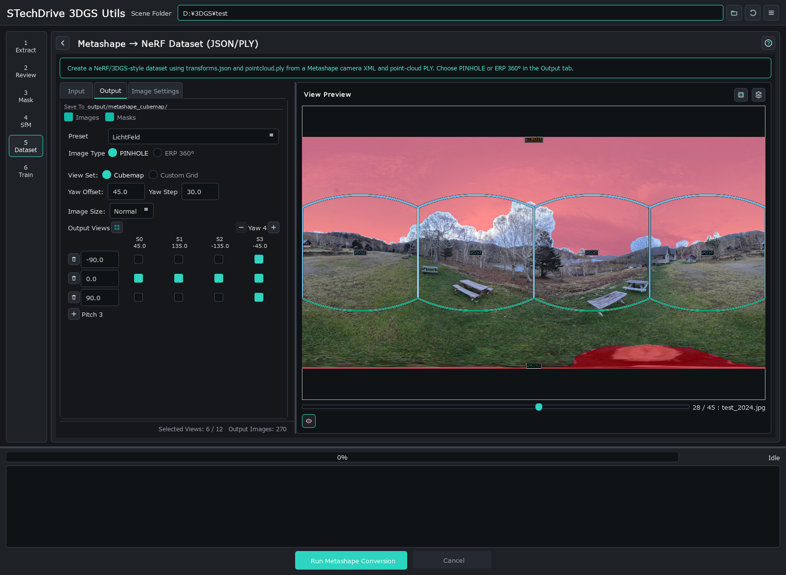

# stechdrive-3dgs-utils

**v1.3.0**

360°カメラの動画から、3D Gaussian Splatting (3DGS) のトレーニングに使いやすい画像・マスク・カメラデータを作るためのWindows向け統合GUIツールです。

`setup_windows.bat` がPython 3.12の検出、必要に応じたインストール、仮想環境の作成、依存パッケージ導入まで行います。起動も `run_gui.bat` から行えるため、普段の作業ではPythonコマンドを直接打たずに使えます。

[EN English](README.md)

Fork元: [tetraface/tetraface-3dgs-utils](https://github.com/tetraface/tetraface-3dgs-utils)



## このアプリでできること

### 1. 360°動画からMetashape SfM、3DGSトレーニングへ

Insta360などの360°カメラで撮影した動画から、SfM向けのエクイレクタングラー静止画を抽出します。抽出後はフレームを確認し、人物、撮影者、三脚、スティッチ境界、白飛びをマスクしてからMetashapeに渡せます。

MetashapeでSfMした結果は、LichtFeld Studio / Postshot / Brush 向けの視点画像、マスク、`transforms.json` に変換できます。360°動画を3DGSトレーニング用データセットにするためのメインワークフローです。

### 2. 360°動画からCOLMAP Rigデータセットへ

Metashapeを使わず、抽出済みの360°画像からCOLMAP Rig形式の視点画像セットを書き出すこともできます。必要に応じてGUIからCOLMAP/GLOMAPまで実行し、3DGSソフトに渡せるSfM済みデータを作成できます。

### 3. 通常の静止画・動画向けのマスク前処理

デジタル一眼、スマホ、通常動画の連番画像に対しても、YOLO/SAMによる人物・車両などのマスクや白飛びマスクを作成できます。SfMソフトに読み込む前のマスク生成ツールとして使えます。

## 主な特徴

- 360°動画からSfM向けフレームを抽出
- 抽出フレームを単一プレビュー/サムネイル一覧で確認し、採用/除外を整理
- YOLO + SAM2.1 による人物・車両などのマスク生成
- 360°画像の下部に写りやすい撮影者、三脚、手元の検出強化
- スティッチ境界、白飛び領域、ユーザー指定PNGカスタムマスクの合成
- 単一プレビュー/サムネイル一覧でマスク結果を確認しながら調整
- プレビュー中の1枚、またはサムネイル一覧で選んだ複数枚を現在設定で再処理
- Metashape SfM結果をLichtFeld Studio / Postshot / Brush向けに変換
- COLMAP Rig形式の視点画像セットを書き出し、COLMAP/GLOMAP実行まで対応
- Windows向けセットアップスクリプトと日本語GUI

## かんたん導入

通常はリリースZIPを展開し、次の2つを順番に実行します。

```bat
setup_windows.bat
run_gui.bat
```

`setup_windows.bat` はPython 3.12を探し、必要な場合はwinget経由でPythonを導入します。その後、`.venv` を作成し、PyTorch CUDA wheel、OpenCV、Pillow、Open3D、ultralytics、PySide6などをインストールして検証します。

`run_gui.bat` は `.venv` を有効化して統合GUIを起動します。既存の `.venv` が正常ならセットアップは再構築せず、その状態を表示して終了します。意図的に作り直す場合は `setup_windows.bat --force` を使います。

既存環境を互換する最新パッケージへ更新する場合:

```bat
update_venv.bat
```

`requirements/` の固定済み既知良好セットで作り直す場合は `update_venv.bat --locked` を使います。

YOLO/SAM2のモデルファイルは初回利用時にultralyticsが自動ダウンロードします。リリースZIPにはモデル重みや生成データは含めていません。

## GUIワークフロー

シーンフォルダのパスに日本語などの非ASCII文字、極端に長いパス、制御文字や `"` が含まれる場合、GUIは実行前に停止します。OpenCVや外部3DGS/SfMツールで失敗しやすいためです。空白やOneDrive配下であることだけでは停止しません。英数字だけの短い作業パス（例: `D:\work\scene01`）を使ってください。

```text
360°動画または画像
  -> Step 1: フレーム抽出
  -> Step 2: フレーム確認・採用/除外
  -> Step 3: マスク生成
  -> Step 4: 書き出し
      -> Metashape SfM結果から3DGS向けデータを作成
      -> COLMAP Rig視点画像を書き出し、必要に応じてCOLMAP/GLOMAPを実行
```

| Step | 内容 | 主なデフォルト |
| --- | --- | --- |
| 1. フレーム抽出 | 360°動画からエクイレクタングラー静止画を抽出 | 固定間隔 + 変化補正 |
| 2. フレーム確認 | 抽出フレームを単一/サムネイル表示で確認し、採用/除外をCSVに反映 | 低品質候補や不要フレームの確認に対応 |
| 3. マスク生成 | YOLO検出、スティッチ境界、白飛び、カスタムマスクを生成 | YOLO検出ON、360°画像は高品質設定 |
| 4. 書き出し | SfM結果からの3DGS出力、またはCOLMAP Rig視点画像を書き出し | Metashapeインポート / LichtFeld / Full / Cube6 |

## 推奨ワークフロー: Metashapeルート

1. Insta360などの360°動画を用意します。
2. Step 1でSfM向けフレームを抽出します。
3. Step 2で低品質候補や不要フレームを確認して除外します。
4. Step 3で人物・撮影者・三脚などのマスクを生成します。360°画像では `YOLO Level 2 高品質` が推奨開始点です。
5. 下部の撮影者が漏れる場合は `下部検出強化` を `高` または `最高` に上げます。
6. 必要に応じてスティッチ境界マスク、白飛びマスクも有効にします。
7. 生成された `masks/` フォルダをMetashapeにマスクとして読み込み、SfMを実行します。
8. Step 4でMetashapeのXML/PLYを使い、3DGSトレーニング用の画像、マスク、`transforms.json` を出力します。

## COLMAPルート

1. Step 1からStep 3まではMetashapeルートと同じです。
2. Step 4で `COLMAP書き出し` を選び、視点画像とマスクを `output/colmap_rig/` に書き出します。
3. 必要に応じて `書き出し後にCOLMAPを実行` をONにし、Feature、Matcher、Mapperまで実行します。
4. 完了後は `output/colmap_rig/` をCOLMAPプロジェクトとして、COLMAP対応の3DGSアプリに渡します。

## 通常画像・通常動画のマスク前処理

通常動画やデジタル一眼・スマホの連番画像を `images/` に置いた場合は、Step 3で `画像タイプ: 通常` を選びます。このモードではスティッチ境界と360°底面再検出を使わず、YOLO/SAMや白飛びマスクだけを生成できます。

人物、車両、白飛びなどをSfM前に除外したい場合の前処理として使えます。

## マスク調整のポイント

- 360°画像では `YOLO Level 2 高品質` から始めます。
- 処理速度を優先する確認用では `1 標準` を使います。
- 人物が漏れる場合は `3 最高`、または `マスク拡張` を少し上げます。
- プレビューで漏れを見つけた場合は、設定を調整して `表示中を再処理` を使うと、その1枚だけ `masks/` に保存し直せます。サムネイル一覧では `Ctrl` / `Shift` 選択した複数枚をまとめて再処理できます。
- 真下付近の撮影者だけ漏れる場合は `下部検出強化` を `標準 -> 高 -> 最高` の順に試します。
- `最高` はより重く、床や地面を余分にマスクする場合があります。
- スティッチ境界マスクは、エクイレクタングラー画像上でスティッチ位置が固定されている素材向けです。FlowState手ブレ補正、方向ロック、AIスティッチ等で境界位置が動く場合は、プレビューで確認してから使ってください。

## 動作環境

- Windows 10/11
- Python 3.12 (3.12.10で確認)
- CUDA対応GPU
- CUDA Toolkit 12.8
- FFmpeg / FFprobe

`setup_windows.bat` で解決される主なPythonパッケージ:

```text
torch / torchvision / torchaudio from the CUDA 12.8 wheel index
numpy, opencv-python, Pillow, open3d, ultralytics, tqdm, PySide6
```

`setup_windows.bat` は `requirements/` 以下の固定済み既知良好セットを使い、初回セットアップの再現性を優先します。`update_venv.bat` はデフォルトで互換する最新パッケージを解決し、固定セットで作り直したい場合だけ `--locked` を渡します。

## CLIツール

GUIは以下のCLIエンジンを呼び出しています。必要なら単体でも実行できます。

| スクリプト | 内容 | ドキュメント |
| --- | --- | --- |
| `extract_frames.py` | 360°動画からフレーム抽出 | [JP](doc/extract_frames.md) |
| `apply_frame_decisions.py` | CSVの採用/除外判定を反映 | [JP](doc/apply_frame_decisions.md) |
| `review_frames.py` | フレーム確認GUI | [JP](doc/review_frames.md) |
| `yolo_mask.py` | YOLO+SAM2.1 マスク生成 | [JP](doc/yolo_mask.ja.md) |
| `stitch_mask.py` | スティッチ境界マスク生成 | [JP](doc/stitch_mask.ja.md) |
| `overexposure_mask.py` | 白飛びマスク生成 | - |
| `cubemap_transforms_json.py` | エクイレクタングラーからキューブマップへ変換 | [JP](doc/cubemap_transforms_json.ja.md) |
| `transforms_to_colmap.py` | `transforms.json` からCOLMAP形式を書き出し | [JP](doc/transforms_to_colmap.ja.md) |

## ライセンス

MIT License。詳細は [LICENSE](LICENSE) を参照してください。

Original code by [tetraface Inc.](https://github.com/tetraface)
Fork extensions by [stechdrive](https://github.com/stechdrive)
